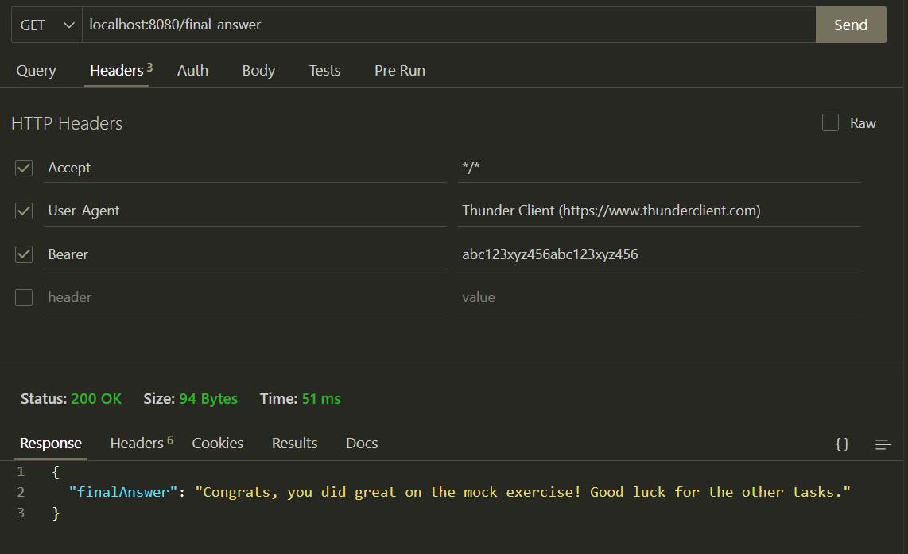

# Express Cloud Server

This is a simple Express server with some boilerplate functionality in a comment-catalogue, so they may be commented out and used as desired.

## Prerequisites

- Node.js
- npm
- (Preferably) A Google Cloud account
- (Preferably) Git

### Installation guides for prerequisites
... Coming soon 🤓

## Installation

1. Clone the repository:
    ```sh
    git clone https://github.com/Marcus4420/expressCloud.git
    cd expressCloud
    ```

2. Install the dependencies:
    ```sh
    npm install
    ```

## Running the Server

To start the server, run:
```sh
npm run start
```

if you want to launch in __development mode__ with hot-reloading, run:
```sh
npm run dev
```


The server will start on port 8080 (which can be changed in server.js). You can access it by navigating to `http://localhost:8080` in your web browser, depending on which endpoints are commented out.

## Endpoints

### Static Files

The server serves static files from the `public` directory.

### Examples of boilerplates

- **Root Path (JSON Response)**
    ```js
    app.get('/', (req, res) => {
      res.send('Hello World!')
    })
    ```

- **Root Path (HTML File)**
    ```js
    app.get('/', (req, res) => {
      res.sendFile('index.html', { root: __dirname })
    })
    ```

- **Fetch Data from External Resource**
    ```js
    app.get('/api', (req, res) => {
      fetch('https://jsonplaceholder.typicode.com/todos/1') //Replace with your url
        .then(response => response.json())
        .then(json => res.send(json))
    })
    ```

### HTTP POST

- **Root Path (JSON Response)**
    ```js
    app.post('/', (req, res) => {
      res.send('Hello World!')
    })
    ```

## External Request Functions

- **Post Data**
    ```js
    async function postData(url = '', data = {}) {
      const response = await fetch(url, {
        method: 'POST',
        headers: {
          'Content-Type': 'application/json',
          'Authorization': 'Bearer ' + token // if needed
        },
        body: JSON.stringify(data)
      });
      return response.json();
    }
    ```

- **Get Data**
    ```js
    async function getData(url = '') {
      const response = await fetch(url, {
        method: 'GET',
        headers: {
          'Content-Type': 'application/json',
          'Authorization': 'Bearer ' + token // if needed
        },
      });
      return response.json();
    }
    ```

## Deployment to Google cloud with CLI
... Coming soon! 🤓


# Mock exam exercise 1
To start the exercise server do
```sh
npm run task1
```
assuming you have installed dependencies and etc.

Go to `http://localhost:8080/magic-header` and see the Authorization bearer token provided.

Then call `http://localhost:8080/final-answer` with the token as shown below


